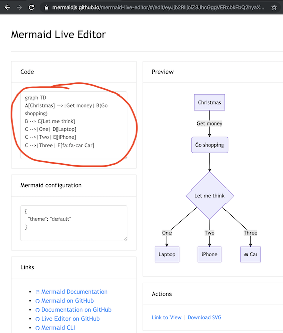
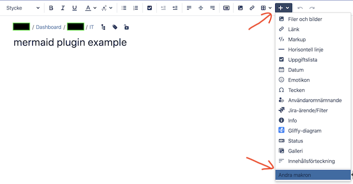
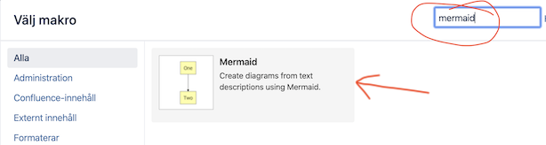
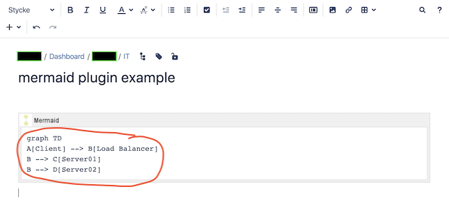
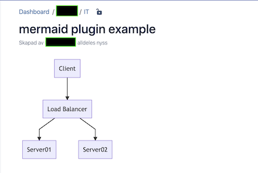

# A more basic getting started

Writing mermaid code is simple.

But how is the code turned into a diagram in a web page? To do this we need a mermaid renderer.

Thankfully the mermaid renderer is very accessible, in essence it is an online javascript.

The requirement is on the part of the web browser. Modern web browsers, such as Firefox, Chrome and Safari, can render mermaid. But Internet Explorer cannot.

The web browser needs access to the online mermaid renderer which it downloads from https://cdn.jsdelivr.net/npm/mermaid

As an easy introduction, here are three practical examples using:
1. an online mermaid editor
2. a mermaid plugin
3. a generic web server of your choosing

Following either of these examples, you can quickly get started writing your own mermaid diagrams.

## the mermaid live editor

The quickest way to get started with mermaid is to visit [The mermaid live editor](https://mermaidjs.github.io/mermaid-live-editor).

In the `Code` section, see image below, one can write or edit raw mermaid code and instantly `Preview` the rendered result.

This is a super fast way to get started.

It is also the easiest way to develop diagrams, the code of which can be pasted straight into your documentation.



The `Mermaid configuration` window of the live editor is for controlling mermaid behaviour.

An easy introduction to mermaid configuration is found in the [Advanced usage](n00b-advanced.md) section.

A configuration reference, also cataloguing default values, is found on the [mermaidAPI](mermaidAPI.md) page.


## mermaid using plugins

Thanks to the growing popularity of mermaid, many plugins already exist which incorporate a mermaid renderer.

One example is the [Atlassian Confluence mermaid plugin](https://marketplace.atlassian.com/apps/1214124/mermaid-plugin-for-confluence?hosting=server&tab=overview)

When the mermaid plugin is installed on a Confluence server, one can insert a mermaid object into any Confluence page.

---

- In a Confluence page, choose to Add Other macros:



---

- Search for mermaid:



---

- The mermaid object appears. Add it to the page and then paste your mermaid code into it.



---

- Save the page and the diagram appears.



---

## mermaid using any web server (or locally with just a browser)

This example can be used with any common web server. Apache, IIS, nginx, node express [...], you pick your favourite.

We do not need to install anything on the server, apart from a normal file of html to be reached by a web browser (such as Firefox, Chrome, Safari, but not Internet Explorer).

So if you want to really simplify things when testing, don't use a web server at all. Just create the file locally and drag it into your browser window. It is the browser which does all the work of rendering mermaid!

In the html file we need to give the web browser three instructions. These are embedded inside the html code in the file:
1. a reference for fetching the mermaid renderer (as the renderer is just an online javascript).
2. the mermaid code we want to diagram.
3. the `mermaid.initialize()` command which starts the rendering process

All this is done in the html `<body>` section of the web page.

So for a concrete stepwise example, this is what needs to go into the html file:


1. The mermaid renderer is referenced in a `<script src>` tag like so:

```
<body>
  <script src="https://cdn.jsdelivr.net/npm/mermaid@8.4.0/dist/mermaid.min.js"></script>
</body>
```

2. The embedded mermaid diagram is placed in a `<div>` tag:

```
<body>
  Here is a mermaid diagram:
  <div class="mermaid">
    graph TD
    A[Client] --> B[Load Balancer]
    B --> C[Server01]
    B --> D[Server02]
  </div>
</body>
```

3. When initializing mermaid using `mermaid.initialize()`, mermaid searches the html body for all the `<div class="mermaid">` tags it can find and starts to render them one by one. This is done like so:

```
<body>
  <script>mermaid.initialize({startOnLoad:true});</script>
</body>
```

*Finally*
4. Putting the three steps together makes for a web page such as:
```
<html>
  <body>
    <script src="https://cdn.jsdelivr.net/npm/mermaid@8.4.0/dist/mermaid.min.js"></script>
    <script>mermaid.initialize({startOnLoad:true});</script>

    Here is one mermaid diagram:
    <div class="mermaid">
      graph TD
      A[Client] --> B[Load Balancer]
      B --> C[Server1]
      B --> D[Server2]
    </div>

    And here is another:
    <div class="mermaid">
      graph TD
      A[Client] -->|tcp_123| B(Load Balancer)
      B -->|tcp_456| C[Server1]
      B -->|tcp_456| D[Server2]
    </div>
  </body>
</html>
```
Save this to a html file and fetch it with a browser from the web server (or just drag it into your web browser window) and voila!

Your web page can in all other respects contain anything you want.

---

## Additional comments:
Knut Sveidqvist, the creator of mermaid, had three additional comments to this page:

- In early versions of mermaid, the `<script src>` tag was invoked in the `<head>` part of the web page. Nowdays we can place it directly in `<body>` as seen above. However, older parts of the documentation frequently reflects the previous way which still works.
  
- We initialize the mermaid rendering directly in the html code with `mermaid.initialize()`. In principle this could be done through placing `mermaid.initialize()` inside of `mermaid.min.js`. We would then eliminate the need for this explicit line in the html. However, there are use cases where we do want to separate the two steps. Sometimes we want full control over when we start looking for `<div>`tags inside the web page with `mermaid.initialize()`. For example this may be when we think that all `<div>` tags may not have been loaded by the time `mermaid.min.js` runs.

- In the example above, `mermaid.min.js` is called using an absolute path. Even worse, the example includes the mermaid version number. This number will naturally change as time goes by. However, the example makes it easy to understand what is going on - even though it is perhaps doomed in a way we do not want in a production environment. I would suggest one of the following approaches for calling `mermaid.min.js`:
  
  1. If you do not enter a specific version, you automatically get the latest one. This is shown on the [advanced usage](n00b-advanced.md) page.
  2. If you really need a specific version, hard code it (this is rare, but it happens).
  3. If you need to know the current mermaid version, replace a mermaid code block with the word `info` and the version will be returned like [this](https://mermaid-js.github.io/mermaid-live-editor/#/edit/eyJjb2RlIjoiaW5mb1xuXG4iLCJtZXJtYWlkIjp7InRoZW1lIjoiZGVmYXVsdCJ9fQ==)
   
