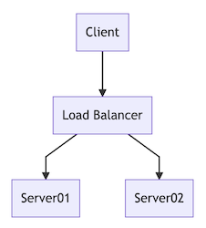

# Overview for n00bs

As an IT professional one frequently has to document things, including drawing stuff.

Using mermaid, typing this as a comment in a script:

```
graph TD
A[Client] --> B[Load Balancer]
B --> C[Server01]
B --> D[Server02]
```

produces this in the documentation:



Most of the stuff in need of visualizing can be scripted in a similar way, with a varitety of different symbols and chart types available. As the diagram source is text based, it can be part of production scripts (and other pieces of code). Less time needs be spent on documenting as a separate task.

Comparing mermaid to Visio and other similar applications, mermaid is a really fast way to create good enough visualizations.

This is especially true when editing a complex diagram. A task which may consume hours with a desktop application, but which can take minutes (or even less if the diagram generation has been scripted) with mermaid.

As the simple text based syntax is in itself inviting to automation of diagram generation, one can quickly end up saving even more time. What's not to love about that?


Due to its origin, a lot of the mermaid documentation is addressed to professional frontend developers and presumes a certain skill set. However, the way mermaid is implemented is so simple that any IT professional can benefit from it almost instantly.

This instruction attempts to broaden the invitation to use mermaid.
